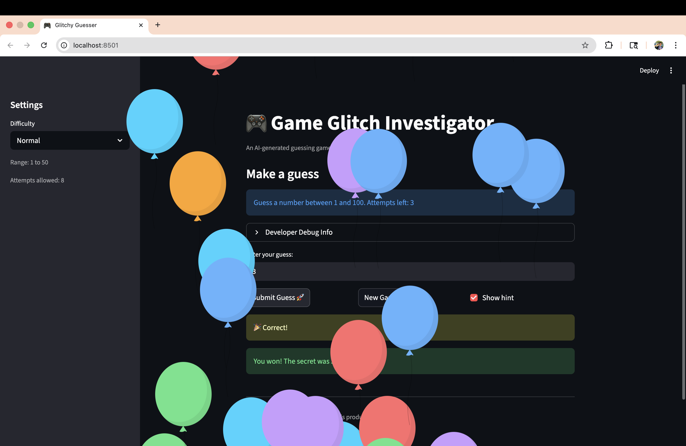

# 🎮 Game Glitch Investigator: The Impossible Guesser

## 🚨 The Situation

You asked an AI to build a simple "Number Guessing Game" using Streamlit.
It wrote the code, ran away, and now the game is unplayable. 

- You can't win.
- The hints lie to you.
- The secret number seems to have commitment issues.

## 🛠️ Setup

1. Install dependencies: `pip install -r requirements.txt`
2. Run the broken app: `python -m streamlit run app.py`

## 🕵️‍♂️ Your Mission

1. **Play the game.** Open the "Developer Debug Info" tab in the app to see the secret number. Try to win.
2. **Find the State Bug.** Why does the secret number change every time you click "Submit"? Ask ChatGPT: *"How do I keep a variable from resetting in Streamlit when I click a button?"*
3. **Fix the Logic.** The hints ("Higher/Lower") are wrong. Fix them.
4. **Refactor & Test.** - Move the logic into `logic_utils.py`.
   - Run `pytest` in your terminal.
   - Keep fixing until all tests pass!

## 📝 Document Your Experience

In this project, I stepped into the role of a "Game Glitch Investigator" to evaluate, debug, and repair an AI-generated Python application. I used GitHub Copilot and Gemini to identify hidden logical errors, such as backward hints and broken scoring systems.

To make the app production-ready, I refactored the codebase by separating the core game logic into a dedicated logic_utils.py file. I then used test-driven development, writing automated tests with pytest to mathematically prove my fixes worked. Ultimately, this project taught me how to effectively manage session state in Streamlit and how to critically analyze AI-generated code rather than blindly trusting it.

## 📸 Demo

This project is a fully functional number guessing game built with Streamlit. The player selects a difficulty (Easy, Normal, or Hard) and has a limited number of attempts to guess a randomly generated secret number between 1 and 100. The game provides accurate "Too High" or "Too Low" hints to help the player win. Originally, the AI-generated starter code was filled with logical bugs and state management issues, but it has now been completely refactored, debugged, and tested.

- 

## 🚀 Stretch Features

- [ ] [If you choose to complete Challenge 4, insert a screenshot of your Enhanced Game UI here]
